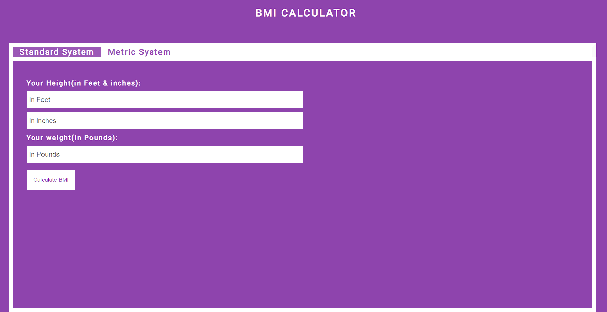

# BMI Calculator

This is a simple BMI (Body Mass Index) calculator web application. It allows users to calculate their BMI based on their weight and height inputs.

## Features

- Calculate BMI instantly based on weight and height inputs.
- User-friendly interface with clear instructions.
- Supports both metric (kg/m^2) and imperial (lbs/in^2) units.
- Provides BMI category classification (underweight, normal weight, overweight, obese) based on calculated BMI.

## Screenshots

### Desktop View


### Mobile View


## How to Use

1. Input your weight in kilograms (or pounds) and your height in meters (or inches).Added a tab system for  easy switching between the two measurement systems.
2. Click on the "Calculate BMI" button.
3. View your BMI result and category classification below.

## Technologies Used

- HTML5
- CSS3
- JavaScript

## Installation

1. Clone the repository:

   ```bash
   git clone https://github.com/your-username/bmi-calculator.git
